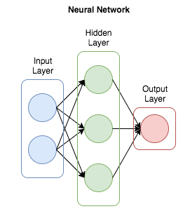
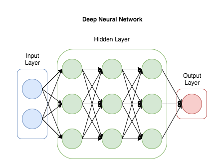
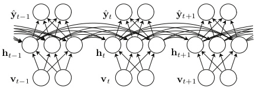
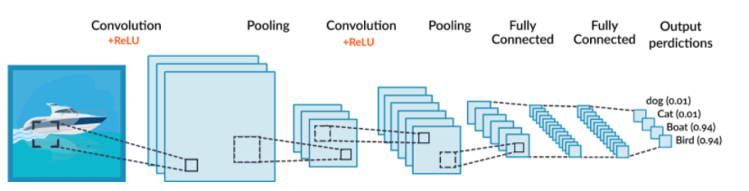
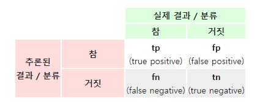
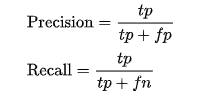
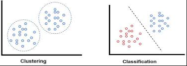
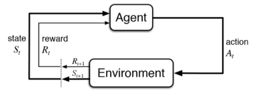

## 머신러닝이란?

본 내용은 위키백과를 참고하였습니다.

인공지능의 기계학습(머신 러닝)과 기계학습의 한 종류인 딥 러닝의 기본적인 내용을 간략하게 설명하겠다.

 

**기계학습 또는 머신러닝(Machine Learning)**

경험을 통해 자동으로 개선하는 컴퓨터 알고리즘의 연구이다.

인공지능의 한 분야이며, 컴퓨터가 학습할 수 있도록 하는 알고리즘과 기술을 개발하는 분야이다.

기계 학습의 핵심은 표현과 일반화에 있다.

표현이란 데이터의 평가이며, 일반화란 아직 알 수 없는 데이터에 대한 처리이다.

 

**심층 학습 또는 딥러닝(Deep Learning)**

여러 비선형 변환기법의 조합을 통해 높은 수준의 추상화를 시도하는 기계 학습 알고리즘의 집합

사람의 사고방식을 컴퓨터에게 가르치는 기계학습의 한 분야

* 비선형 : 순차적이지 않은

* 추상화(abstractions) : 다량의 데이터나 복잡한 자료들 속에서 핵심적인 내용

 

**인공신경망(ANN, Artificial Neural Network)**

사람의 신경망 원리와 구조를 모방하여 만든 기계학습 알고리즘이며, 가장 작은 요소인 artificial neuron 부터 multi-layer ANN이 있다.

인공신경망에는 교사 신호(정답)의 입력에 의해서 문제에 최적화되어 가는 

<u>교사 학습(지도 학습)</u>과 교사 신호를 필요로 하지 않는 <u>비교사 학습(비지도 학습)</u>이 있다. 명확한 해답이 있는 경우에는 교사 학습이, <u>데이터 클러스터링</u>에는 비교사 학습이 이용된다. 다른 기계학습과 같이 신경망은 일반적으로 규칙기반 프로그래밍으로 풀기 어려운 <u>컴퓨터 비전</u> 또는 <u>음성 인식</u>과 같은 다양한 범위의 문제를 푸는데 이용된다.

 

 

**심층 신경망(DNN, Deep Neural Network)**

신경망은 다수의 입력 데이터를 받는 입력층(INPUT), 데이터의 출력은 출력층(Output), 입력층과 출력층 사이에 여러개의 은닉층(Hidden Layer)들로 이뤄진 인공신경망(ANN)이다.

심층 신경망은 일반적인 [인공신경망](https://ko.wikipedia.org/wiki/인공신경망)과 마찬가지로 복잡한 [비선형](https://ko.wikipedia.org/wiki/비선형) 관계(non-linear relationship)들을 [모델링](https://ko.wikipedia.org/wiki/모델링)할 수 있다

비슷하게 수행된 [인공신경망](https://ko.wikipedia.org/wiki/인공신경망)에 비해 더 적은수의 [유닛](https://ko.wikipedia.org/wiki/유닛)(unit, node)들 만으로도 복잡한 [데이터](https://ko.wikipedia.org/wiki/데이터)를 [모델링](https://ko.wikipedia.org/wiki/모델링)할 수 있게해준다.

이전의 심층 신경망들은 보통 앞먹임 신경망으로 설계되어 왔지만, 최근의 연구들은 심층 학습 구조들을 순환 신경망(Recurrent Neural Network, RNN)에 성공적으로 적용했다.

 

 

**순환 신경망(RNN, Recurreent Neural Network)**

순환 신경망은 [인공신경망](https://ko.wikipedia.org/wiki/인공신경망)을 구성하는 유닛 사이의 연결이 Directed cycle을 구성하는 신경망을 말한다. 순환 신경망은 앞먹임 신경망과 달리, 임의의 입력을 처리하기 위해 신경망 내부의 메모리를 활용할 수 있다. 이러한 특성에 의해 순환 신경망은 필기체 인식(Handwriting recognition)과 같은 분야에 활용되고 있고, 높은 인식률을 나타낸다. 순환 신경망을 구성할 수 있는 구조에는 여러가지 방식이 사용되고 있다. 완전 순환망(Fully Recurrent Network), Hopfield Network, Elman Network, Echo state network(ESN), Long short term memory network(LSTM), Bi-directional RNN, Continuous-time RNN(CTRNN), Hierarchical RNN, Second Order RNN 등이 대표적인 예이다.

 

순환 신경망을 훈련(Training)시키기 위해 대표적으로 [경사 하강법](https://ko.wikipedia.org/wiki/경사_하강법), Hessian Free Optimization, Global Optimization Methods 방식이 쓰이고 있다. 하지만 순환 신경망은 많은 수의 뉴런 유닛이나 많은 수의 입력 유닛이 있는 경우에 훈련이 쉽지 않은 스케일링 이슈를 가지고있다.

 

 

**합성곱 신경망(CNN, Convolutional Neural Network)**

합성곱 신경망(Convolutional Neural Network, CNN)은 최소한의 전처리(preprocess)를 사용하도록 설계된 다계층 [퍼셉트론](https://ko.wikipedia.org/wiki/퍼셉트론)(multilayer perceptrons)의 한 종류이다.

CNN은 하나 또는 여러개의 [합성곱](https://ko.wikipedia.org/wiki/합성곱) 계층과 그 위에 올려진 일반적인 인공 신경망 계층들로 이루어져 있으며, 가중치와 통합 계층(pooling layer)들을 추가로 활용한다. 이러한 구조 덕분에 CNN은 2차원 구조의 입력 데이터를 충분히 활용할 수 있다. 다른 딥 러닝 구조들과 비교해서, CNN은 영상, 음성 분야 모두에서 좋은 성능을 보여준다

 

합성곱 신경망이 자동음성인식(Automatic Speech Recognition, ASR)을 위한 음향 모델링(acoustic modeling) 분야에 적용되었으며, 기존의 [모델](https://ko.wikipedia.org/wiki/모델)들보다 더욱 성공적으로 적용되었다는 평가를 받고 있다

 

 

## 머신러닝 학습 방법

 

훈련 데이터(Training Data)로부터 하나의 함수를 유추해내기 위한 [기계 학습](https://ko.wikipedia.org/wiki/기계_학습)(Machine Learning)의 한 방법이다. 훈련 데이터는 일반적으로 입력 객체에 대한 속성을 벡터 형태로 포함하고 있으며 각각의 벡터에 대해 원하는 결과가 무엇인지 표시되어 있다. 이렇게 유추된 함수 중 연속적인 값을 출력하는 것을 [회귀분석](https://ko.wikipedia.org/wiki/회귀분석)(Regression)이라 하고 주어진 입력 벡터가 어떤 종류의 값인지 표식하는 것을 [분류](https://ko.wikipedia.org/wiki/분류)(Classification)라 한다.

  

훈련 데이터로부터 하나의 함수가 유추되고 나면 해당 함수에 대한 평가를 통해 파라미터를 최적화한다. 이러한 평가를 위해 [교차 검증](https://ko.wikipedia.org/w/index.php?title=교차_검증&action=edit&redlink=1)(Cross-Validation)이 이용되며 이를 위해 검증 집합(Validation Set) 을 다음의 3가지로 나눈다.

- 훈련 집합(A Training Set)
- 검증 집합(A Validation Set)
- 테스트 집합(A Test Set)

이러한 [교차 검증](https://ko.wikipedia.org/w/index.php?title=교차_검증&action=edit&redlink=1)을 통하여 훈련된 각 함수에 대해 정밀도(Precision)와 재현율(Recall)를 측정할 수 있다.

 

 

 

#### 지도 학습을 이용한 알고리즘

- 서포트 백터 머신 (support vector machine, SVM) - Classification
- 의사결정 트리 - Classification
- 은닉 마르코프 모델 (Hidden Markov model)
- 차원 축소 (Dimentionality Reduction)
- 회귀 분석 (Regression) [Ridge, Lasso]
- CNN
- RNN

####   

#### 2. 비지도 학습 (기계학습, 자율 학습)

  

기계 학습의 일종으로, 데이터가 어떻게 구성되었는지를 알아내는 문제의 범주에 속한다.

그래서 데이터의 특징을 요약하거나 군집화하는데 주로 사용한다.

이 방법은 지도학습 혹은 강화 학습과는 달리 입력값에 대한 목표치가 주어지지 않는다.

목표값을 정해주지 않아 사전 학습이 필요없으므로 속도가 빠르다.

 

 

#### 비지도 학습을 이용한 알고리즘

- K-Means

- Clustering

- DBSCAN

- Mean Shift

- 주성분 분석

   

#### 3. 강화 학습

 

강화학습은 기계 학습의 한 영역이다.

심리학의 한 분야인 행동심리학에서 영감을 받았으며, 어떤 환경 안에서 정의된 에이전트가 현재의 상태를 인식하여, 선택 가능한 행동들 중 보상을 최대화하는 행동 혹은 행동 순서를 선택하는 방법이다.

  

즉, 사람이 처음에 걸음마를 배울 때 넘어지고 일어서고를 반복하여 학습하여 걷게 될 수 있는 것과 동일하다.

  

바둑을 예로 들자,

바둑 돌의 위치(현재의 상태)가 State 라고 가정하면, 다음 수를 취하는 것이 Action 이며 취하는 행동이 최적인지를 학습 하는것이다.

상대 바둑 돌을 잡았을때 Reward(보상)가 주어지며, 이러한 보상이 최대화 하도록 학습을 진행시켜야 한다.

 

당장에 바둑돌을 잡지않아도 나중에 잡을 수 있는 값이 Delay Reward(지연된 보상)이다.

당장에 보상이 적더라도 Delay Reward을 포함한 보상값의 총 합이 최대치가 되도록 Action을 취해야 하며, 미래를 고려하여 가장 좋은 선택을 하며 학습을 시키는것이 강화학습이다.