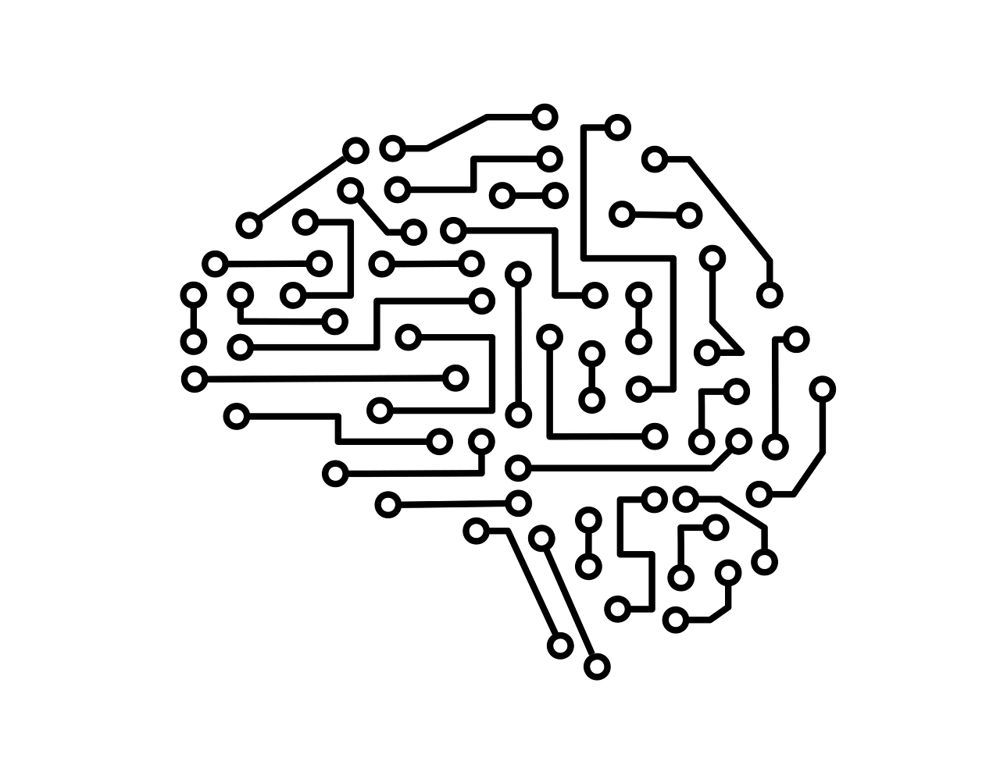

## 🦥 용어 정리

\* 이 글의 내용은 O'REILLY의 '파이썬 라이브러리를 활용한 머신러닝' 책을 기반으로 한다.

1. scikit-learn : 파이썬 머신러닝 라이브러리

2. Numpy : 파이썬 과학 계산 패키지 (다차원 배열, 선형 대수 연산)   푸리 변환(시간 함수 신호 를 주파수 성분으로 분해하여 변환)

3. Scipy : 파이썬 과학 계산 함수 패키지 (선형 대수, 통계 분포)

4. matplotlib : 파이썬 과학 계산용 그래프 라이브러리 (선 그래프, 히스토그램, 산점도)

5. pandas : 데이터 처리와 분석을 위한 파이썬 라이브러리(DataFrame)

6. mglearn : 그래프나 데이터 적재 유틸리티 함수

7. train_test_split : 데이터셋을 섞어서 나눠주는 함수

8. Estimator : 추측하여 판정 -> 표집값들로부터 모수(모집단의 대푯값)의 값을 추정하는 방법

   - model : x.estimator.<> : 클래스 인스턴스화

   - model.train() : 학습

   - model.evaluate() : 평가

   - model.predict() : 예측

 

9.  fit : 훈련데이터, 훈련데이터의 레이블을 매개변수로 받음 (X_train, Y_train)

10. np.mean(y_pred == y_test) : 모델 성능 확인을 위한 정확도 검사(평균값)

11. KNeightborsClassifier .score(X_test, y_test) : 모델 성능 확인을 위한 정확도 검사(평균값)

12. k-최근접 이웃 알고리즘(KNeightborsClassifier) : 매개변수 -> 측정치 사이의 거리를 재는 방법, 이웃의 수

 

13. 선형 모델 : 입력 특성에 대한 선형 함수를 만들어 예측
      선형 회귀(최소 제곱법) : 예측과 훈련데이터 타깃 y 사이의 평균제곱오차를 최소화하는 기울기w와 b값을 찾음

 

14. LinearRegression() : 선형회귀 모델로서 기울기 파라미터(가중치) 사용 -> coef_ 속성에 저장(_는 사용자가 지정한 매개변수와 구분하기 위해)

 

15. 가중치 규제 : 모델이 복잡해지지 않도록 모델 복잡도에 벌점을 줌
      복잡해진다 = 불필요한 항이 많아진다 -> 규제가 필요함 -> 규제의 종류 : L1 규제, L2규제
      중요한 특성이 많지 않다 -> L1 규제
      중요한 특성이 많다 -> L2 규제

 

16. 리지 회귀 : 선형회귀 모델로서 가중치의 절댓값을 가능한 작게 만듬(0에 가깝게) -> L2 규제
    가중치의 규제로 알파를 사용 알파를 크게 하면 패널티의 효과가 커지고(가중치 감소) 알파를 작게 하면 작아진다.

 

17. 학습 곡선 : 데이터셋의 크기에 따른 모델의 성능 변화를 나타낸 그래프(default alpha = 0.1)

 

18. 라소(Lasso) : 선형회귀에 규제를 적용하는 데 Ridge의 대안 -> L1 규제

    - 리지 VS 라소 : 분석하기 쉬운 모델 또는 특성이 많고 그중 일부분만 중요하다면 Lasso, 반대는 리지

 

19. ElasticNet : Lasso와 Ridge의 페널티를 결합(최상의 성능)

 

20. 손실 함수(loss function) : 신경망이 학습할 수 있도록 해주는 지표이며, 오차이다 이 손실 함수 값이 최소화되도록 가중치와 편향을 찾는 것이 학습이다.
      (1) 평균 제곱 오차
      (2) 교차 엔트로피 오차

 

21. 활성화 함수(activation function) : 입력값을 받았을 때 다음으로 넘길지 말지 정하는 함수(전달할때 1 , 전달하지 않을 때 0)
      (1) sigmoid function : 0과 1사이 -> 분계점을 정하는 함수(구간)
      (2) Relu

 

22. 학습단계
      (1) 데이터 수집
      (2) fictures 정의
      (3) 가설 정의
      (4) 비용 함수 정의
      (5) 학습

 

23. afork = 1 cycle (랜덤하게 쪼개주는 함수)

 

24. 신경망(퍼셉트론) : 다수의 신호를 입력받아 하나의 신호를 출력

 

25. 선형 분류 알고리즘
      (1) 로지스틱 회귀(logistic regression)
      (2) 서포터 벡터 머신(SVC)
      둘다 매개변수 C를 사용하여 C의 값이 높아지면 규제가 감소

 

26. 다중 클래스 분류용 선형 모델 : 보편적으로 일대다 방법을 많이 사용

 

27. 결정 트리 복잡도 제어
      (1) 사전 가지 치기 : 트리 생성을 중단
      (2) 사후 가지 치기 : 트리를 만든 후 데이터 포인트가 적은 노드 삭제 혹은 병

 

28. 결정 트리 깊이 제한 : max_depth

 

29. 특성 중요도 : 각 특성의 중요도 평가 (전체 합 1)

 

30. 외삽 : 훈련 데이터의 범위 밖의 포인트

 

31. 앙상블(ensemble) : 여러 머신러닝 모델을 연결하여 강력한 모델을 만드는 기법

  앙상블 방법론 : 부스팅, 배깅

 

32. 배깅(Bootstrap aggregation):중복을 허용한 랜덤 샘플링으로 만든 훈련 세트를 사용하여 분류기를 각기 다르게 학습 

- 대표적인 모델

  (1) 랜덤 포레스트(Random Forest) 결정 트리 : 의사 트리들을 서로 엮어 큰 숲으로 만들어 보다 좋은 예측을 하는 기법

  (매개변수 : Regressor)

 

33. 부스팅 : 단순하고 약한 학습기를 결합해서 보다 정확하고 강력한 학습기를 만드는 방식

  - 대표적인 모델

      (1)그레이디언트 부스팅(Grandient Boosting) 결정 트리

      손실함수를 파라미터로 미분해서 기울기를 구하고, 값이 작아지는 방향으로 가다가 손실함수가 최소화되는 지점에    도달하게끔 탐색함 (매개변수 : n_estimators)

       
      (2)에이다부스트(Adaptive Boosting) : 이전의 모델이 잘못 분류한 샘플에 가중치를 높여서 다음 모델을 훈련시킴

 

34.  랜덤 포레스트(Random Forest) 결정 트리

      (1) 분류, 회귀 분석 등에 사용되는 앙상블 학습 방법의 일종

      (2) 훈련 과정에서 구성한 다수의 결정 트리로부터 분류 또는 평균 예측치(회귀 분석)를 출력

 

35. 엑스트라 트리(Extra_Trees) : 후보 특성을 무작위로 분할한 다음 최적의 분할을 찾음

 

36. splitter
      (1)splitter='best' : default
      (2)splitter='random' : 무작위로 분할한 후보 노드중 최선을 찾음
